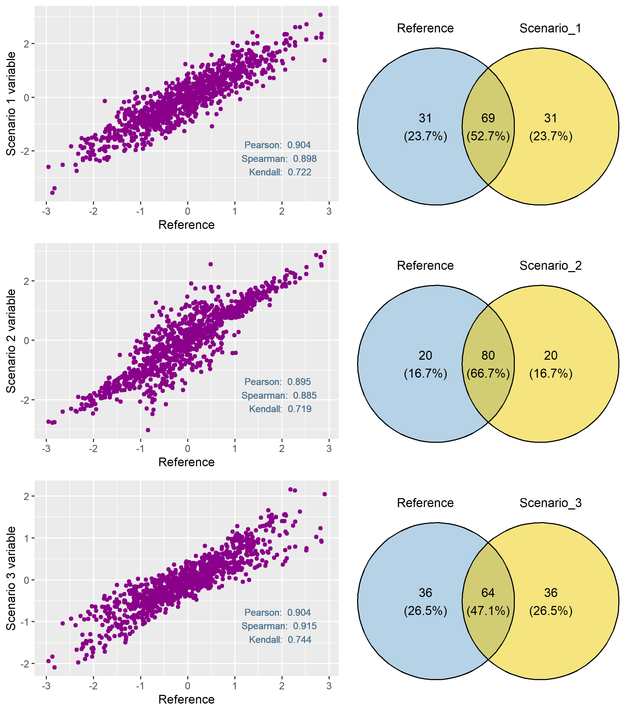

Thinking out loud 1: genetic evaluation accuracy assessment
================
F.Pappas
2023-12-03

## The question

The realm of applied quantitative genetics is all about refinement,
testing, and application of methodologies aimed at precisely predicting
the genetic merit of individuals concerning specific traits within
well-defined populations. Despite my relatively recent introduction to
this field, I was surprised to discover that there is discourse on the
meticulous assessment of the accuracy of genetic evaluations. It is
common practice for researchers in the field to evaluate and compare
different analytical methods and information sources in terms of
prediction accuracy using either simulated or real-world datasets. Most
common way to quantify that (in simulation studies) is to calculate
Pearson’s correlation coefficient using the vectors of the estimated and
the true breeding values. As a covariance-based statistic it of course
represents how strongly linked the two variables are but what selective
breeding methodology is most commonly after is to reliably select a
proportion of top-ranking individuals (or exclude low-ranking
candidates) to be kept as parents of the next generation. This entails
that the aforementioned coefficient might not be fully indicative of the
desired “accuracy” assessment (see scenarios below). So the question
arises: how could an alternative metric look like?

## Example scenarios

In the figure below the same “base-scenario vector” is plotted against
vectors from 3 other scenarios, all of which present very similar
Pearson’s correlation coefficient to the “base”. Try to first only focus
on the left side and in particular the different correlation metrics
(covariance- and rank- based) in the bottom-right corner of each
scenario-plot. Can you rank the scenarios from best to worst? Which
metric would you trust the most under a selective breeding context
knowing that you are opting for selection of 100 candidates (top 10%)?

On the right side of the figure there are venn diagrams visualizing the
intersection between the top 100 candidates set of the base and the
respective top 100 sets of the three tested scenarios. Notice that the
“best” scenarios according to correlation coefficients are recovering
notably less top ranking candidates compared to scenario 2 (80% of true
set recovered).

Correlations and venn diagrams:

## Formula:

A suggestion of how a metric could look like is briefly described below.

The Sorensen Dice Coefficient expresses similarity between sets A and B
as such:

$$SDC(A,B)=\frac{2*|A \cap B|}{|A|+|B|}$$

For variables x, y and percentile p we define the left-side
percentile-defined set similarity as:

$$PSS_l(X_p,Y_p)=2\frac{|X_p \cap Y_p|}{|X_p|+|Y_p|}=100\frac{|X_p \cap Y_p|}{pN}$$
where: $X_p={\{x∈X∣x \le Q_{p/100}\}}$

Similarly, we define the right-side set similarity as:
$$PSS_r(X_p,Y_p)=100\frac{|X_p \cap Y_p|}{pN}$$ where:
$X_p={\{x∈X∣x \ge Q_{p/100}\}}$

Finally, we define a Percentile-defined Set Similarity Index for
variables x and y with percentile step p:

$$PSSI_p(x,y)=\frac{\sum_{i = p/100}^{0.5}{\frac{(1-i)}{2}(PSS_l(X_i,Y_i) + PSS_r(X_{1-i},Y_{1-i}))}}{\sum_{i = p/100}^{0.5}{(1-i)}}$$

Step p can be adjusted accordingly to the proportion of selected (or
excluded) candidates in the breeding scenario.

## Algorithm demonstration

## How does it work?

The figure below represents the same data-sets as in the initial one but
now the new metric (for p=10% and p=5%) has been printed.

